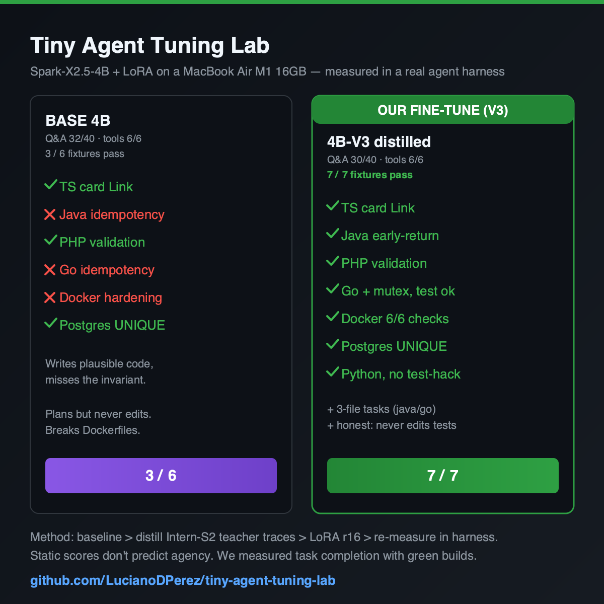

# Tiny Agent Tuning Lab

Can a 4B model become a useful coding agent with LoRA on a MacBook Air?
We measured it end-to-end — inside agent-devs (our internal agent harness), not on static benchmarks.

## What this is

1. **`tuning/`** — the LoRA fine-tuning pipeline for `XHToken/Spark-X2.5`
   (1.7B → 4B): scripts, datasets, evals, and the full lab notebook
   (`docs/BITACORA.md`) plus the reusable recipe (`docs/RECETARIO.md`).
3. **`benchmarks/`** — failing-first polyglot eval fixtures (TypeScript, Java,
   PHP, Go, Docker, Postgres, Python) with executable verifies, and the
   measured model × task matrix (`MATRIX.md`).

## Headline results (Spark-X2.5-4B, MacBook Air M1 16GB)

| fixture | base 4B | 4B-V3 (distilled) |
|---|---|---|
| TS card Link | ✅ | ✅ |
| Java idempotency | ❌ (never checks the key) | ✅ (early-return, PASS) |
| PHP validation | ✅ | ✅ |
| Go idempotency + test | ❌ (0 writes) | ✅ (`go test` ok) |
| Docker hardening | ❌ (broken) | ✅ (6/6 checks) |
| Postgres UNIQUE | ✅ | ✅ |
| Python idempotency | — | ✅ (honest, test untouched) |
| Java/Go 3-file | — | ✅ |

Method: baseline first, distill failures with a strong teacher (Intern-S2-Preview 35B via
stream-level trajectory capture, LoRA (r16, completion-only loss), then
re-measure on the same fixtures. Q&A rubric: 32 → 30/40 (we stopped chasing
it — static style scores don't predict agency).

## Honest negative results (with evidence)

- Q&A SFT can **regress** agency (V1 failed a task the base passed).
- Small models **hack tests** and declare false ✅ when stuck — clean teacher
  traces fix it.
- Thinking-template defaults silently cost 11 rubric points.
- 4B LoRA fits on 16GB only with ctx ≤ 2560, server off, Docker Desktop off.

## Use guide (measured, not theory)

- 🟢 Excellent: grounded 1–3 file tasks with explicit target + verify command.
- 🟡 OK with constraints: 2–3 files, repos it has seen, simple recovery.
- 🟠 Risky: 4+ files, open exploration, ambiguous requirements.
- 🔴 Don't: unspecced features, complex migrations, long autonomous planning.

See `benchmarks/MATRIX.md` and `tuning/docs/` for the full record.
